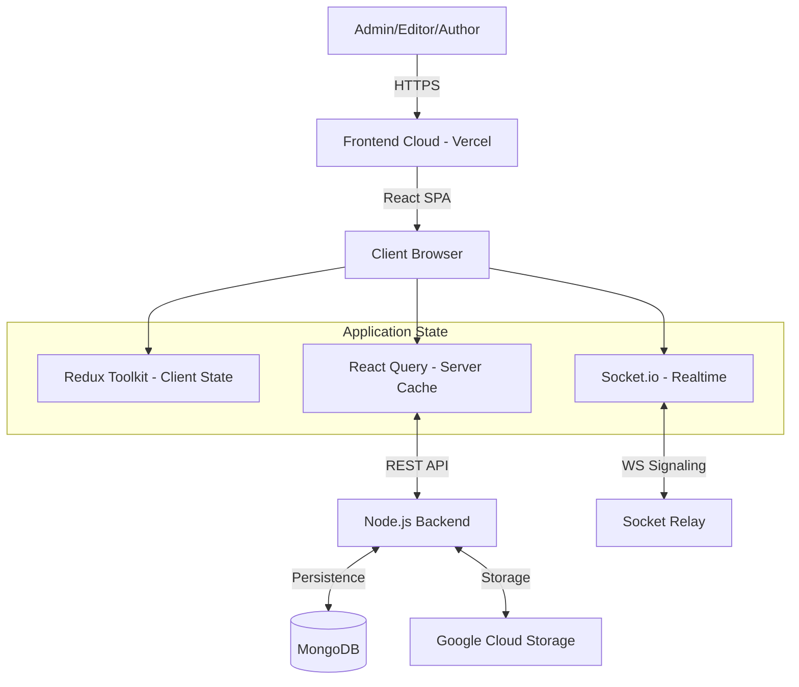
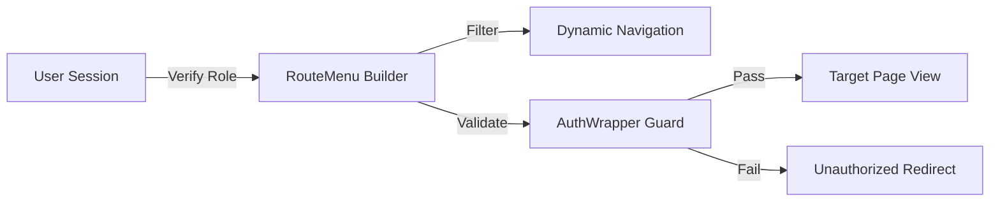
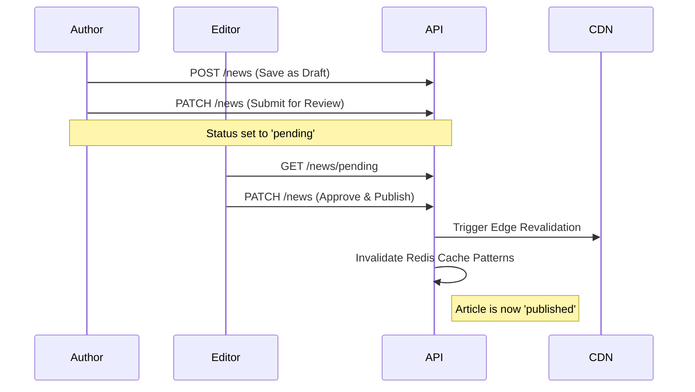

# Z-News Admin Panel

A modern, enterprise-grade administration engine for managing the Z-News ecosystem. Built with **React 19**, **TypeScript**, and **Modern Web Technologies**, this system provides centralized orchestration for editorial workflows, media assets, hierarchical taxonomies, and real-time user engagement. It serves as the command center for the Z-News platform, featuring granular role-based security, live analytics, and a modular architecture.

---

## Table of Contents

- [Core Modules and Features](#core-modules-and-features)
- [Tech Stack](#tech-stack)
- [Architecture](#architecture)
- [Project Directory Map](#project-directory-map)
- [Standard Operation Patterns](#standard-operation-patterns)
- [Custom Infrastructure](#custom-infrastructure)
- [Getting Started](#getting-started)
- [Workflow Diagrams](#workflow-diagrams)
- [Development and Deployment](#development-and-deployment)

---

## Core Modules and Features

### Dashboard & Analytics

The nerve center of the platform, providing real-time visibility into the ecosystem's health.

- **Intelligent Statistics**: Real-time cards showing article counts, user growth, active comments, and media storage status.
- **Data Visualization**: Interactive Recharts integration for visualizing editorial trends, category distribution, and user engagement metrics.
- **Activity Streams**: Live tracking of system-wide actions with role-based visibility.
- **Real-time Sync**: Dashboard state updates instantly via Socket.io without page refreshes.

### Editorial Content Engine

Comprehensive management of the platform's primary value driver—news content.

- **State-of-the-Art Editor**: Integration with **BlockNote** for a Notion-like, block-based rich text editing experience.
- **Lifecycle Management**: Precise control over article states (`Draft`, `Pending`, `Published`, `Archived`).
- **Specialized Segments**: Dedicated workflows for managing `Breaking News`, `Headline Stories`, and `Featured Articles`.
- **Engagement Monitoring**: Integrated view of comments and reactions directly within article detail pages.

### Taxonomy & Event Orchestration

A flexible system for organizing and categorizing content.

- **Recursive Categories**: Hierarchical category management supporting infinite nesting with parent-child relationships.
- **Sequence Control**: Drag-and-drop or index-based ordering for category and event prioritization.
- **Event Linking**: Specialized module for managing time-sensitive events and linking them to editorial content.

### Media & Asset Management

A robust interface for handling high-volume media traffic.

- **Cloud Storage Interface**: Seamless integration with Google Cloud Storage for scalable asset hosting.
- **Media Library**: Centralized view for all uploaded files with advanced filtering by type and metadata.
- **Asset Preservation**: Automatic filename sanitization and unique suffix generation to prevent collisions.

### User & Security Administration

Granular control over the system's human resources.

- **Multi-Role RBAC**: Strict permission enforcement across `supper-admin`, `admin`, `editor`, `author`, `contributor`, and `user`.
- **Identity Control**: Account verification, status management (active/blocked), and detailed session tracking.
- **Secure Profile Management**: Dedicated `/self` endpoints for users to manage their own presence securely.

### System Integrity (Recycle Bin)

A failsafe layer for preventing accidental data loss.

- **Soft-Delete Recovery**: Centralized interface for viewing all logically deleted items across all modules.
- **Granular Restoration**: One-click restoration or permanent byte-level eradication of system assets.

---

## Tech Stack

| Category             | Technology                                      |
| :------------------- | :---------------------------------------------- |
| Runtime Environment  | Node.js (v20+)                                  |
| Core Framework       | React 19 (Modern Concurrent Rendering)          |
| Programming Language | TypeScript (Strict Mode)                        |
| Build Tool           | Vite (ESM-based HMR)                            |
| Styling              | Tailwind CSS 4 & CVA (Utility-first)            |
| State Management     | Redux Toolkit & TanStack Query v5               |
| Real-time Signaling  | Socket.io Client                                |
| Content Editing      | BlockNote (Block-based Rich Text)               |
| Data Visualization   | Recharts                                        |
| Security Architecture| JWT, Zod Validation, RBAC Higher Order Wrappers |

---

## Architecture

### System Architecture Diagram

<div align="center">



</div>

### Navigation & Permission Architecture

<div align="center">



</div>

---

## Project Directory Map

```text
src/
├── assets/          # Static assets and centralized navigation data
├── builder/         # Core utility classes (RouteMenu, FormBuilder)
├── components/      # UI Layer
│   ├── (auth)/     # Authentication specific views
│   ├── (common)/   # Feature-specific page components (Admin/Editor)
│   ├── ui/         # Pure, custom-built UI primitives (Button, Table, etc.)
│   └── wrappers/   # Permission and Auth HOCs (AuthWrapper)
├── config/          # Environment and project constants
├── hooks/           # Domain-specific React hooks (observers, states)
├── layouts/         # High-level architecture layouts (Common, Auth, User)
├── lib/             # API clients and core library configurations
├── pages/           # Routed page components
├── redux/           # Global client-side state management
├── services/        # Backend API service contracts
├── types/           # Global TypeScript interfaces
└── utils/           # Shared helper functions
```

---

## Standard Operation Patterns

To ensure consistency across the massive modular surface, the project follows strict interface patterns:

- **Data Tables**: All listings use a custom `DataTable` component with server-side pagination, search, and CSV export capabilities.
- **Mutations**: Create/Update actions are handled via standardized Modals or specialized Mutation Pages with automatic cache invalidation.
- **State Flow**: Server data always flows through TanStack Query, while UI toggles (sidebar, modals) are orchestrated by Redux.

---

## Custom Infrastructure

### RouteMenu Engine

The `RouteMenu` class is a proprietary routing layer that centralizes navigation definitions and permission logic. It automatically generates the application sidebar, breadcrumbs, and route protection based on the user's JWT roles.

### Custom-Built UI System

This project deviates from off-the-shelf libraries by using a **highly optimized, custom-built UI component system**. Every primitive—from the `DataTable` to the `RichTextEditor`—is tuned for the specific editorial needs of the Z-News platform, resulting in minimal bundle overhead and maximal responsiveness.

---

## Getting Started

### Prerequisites

- **Node.js** (v18.0.0+)
- **pnpm** (Recommended package manager)

### Installation & Execution

1.  **Clone and Navigate**:
    ```bash
    git clone <project-url>
    cd z-news-adminpanel
    ```

2.  **Install Dependencies**:
    ```bash
    pnpm install
    ```

3.  **Environment Provisioning**:
    Create a `.env` file in the root and configure the backend targets:
    ```env
    VITE_API_URL=http://your-api-url
    VITE_SOCKET_URL=http://your-socket-url
    ```

4.  **Launch Local Instance**:
    ```bash
    pnpm dev
    ```

---

## Workflow Diagrams

### Content Publication Workflow

<div align="center">



</div>

---

## Development and Deployment

### Code Standards

- **Strict TypeScript**: No implicitly `any` types allowed.
- **Linting**: Continuous enforcement via ESLint with Prettier integration.
- **Component Design**: Functional components only, utilizing the Atomic Design pattern for primitives.

### Distribution

Build the production-ready optimized SPA:
```bash
pnpm build
```

The resulting assets in `/dist` are ready for deployment on enterprise static hosting providers (Vercel, AWS S3/CloudFront, or Nginx).

---

## Support & License

Proprietary and Confidential. Unauthorized distribution or reproduction is strictly prohibited.

---

**Crafted with excellence using React 19, TypeScript, and Tailwind CSS.**
